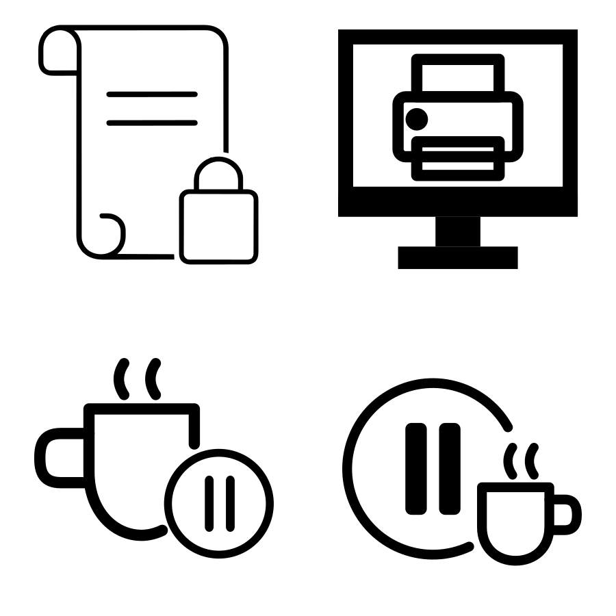

# Workflow Function Icons

Custom SVG workflow and keyboard-function remix icons created with Inkscape.

Inspired by classic keyboard function keys, developer workflows, retro computing aesthetics, and keyboard customization communities.

---

## Included Icons

- Print Screen
- Scroll Lock
- Pause/Break
- Break/Pause

---

## Design Philosophy

These icons were created by combining and modifying multiple SVG concepts into cohesive workflow-oriented symbols.

The goal was to create icons that:

- remain readable at small sizes
- feel visually consistent
- balance playful and professional aesthetics
- work well for keyboards, decals, stickers, and UI projects

Each icon was refined through iterative vector editing, overlap hierarchy adjustments, node editing, and scaling tests inside Inkscape.

---

## Tools Used

- Inkscape
- SVG Repo
- Open-source SVG resources
- GitHub

---

## Acknowledgements

Special thanks to the open-source SVG and design communities for providing inspiration and reusable vector resources that helped make these remix-style icons possible.

Several icons were created by combining and modifying multiple SVG concepts into original composite designs.

SVG Repo:
https://www.svgrepo.com/

---

## License

MIT License
