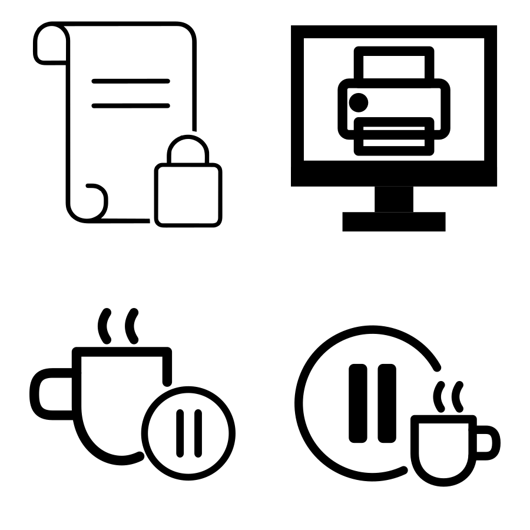

# Workflow Function Icons

A small collection of custom SVG icons that reinterpret classic keyboard
function keys as workflow-oriented visual symbols.

The icons were created in Inkscape by combining, modifying, and refining
multiple vector concepts into a consistent set suitable for keyboard
customization, documentation, decals, stickers, and user-interface projects.



## Included Icons

- [Break / Pause](svg/break-pause.svg)
- [Pause / Break](svg/pause-break.svg)
- [Print Screen](svg/print-screen.svg)
- [Scroll Lock](svg/scroll-lock.svg)

Each icon is provided as an individual SVG for direct viewing, downloading,
editing, or integration into another project.

## Design Approach

The collection draws inspiration from classic keyboard function keys,
developer workflows, retro computing aesthetics, and keyboard customization
communities.

The icons were refined through:

- vector path and node editing;
- overlap and layer adjustments;
- visual hierarchy refinement;
- alignment and proportion testing;
- scaling tests for readability at smaller sizes.

The paired Break/Pause and Pause/Break designs explore two visual arrangements
of the same related functions.

## Using the Icons

SVG files can be opened directly in modern browsers and edited in vector tools
such as Inkscape, Adobe Illustrator, or compatible design applications.

To reference an icon from HTML:

```html

```

When using an icon in an interface, provide accessible text that describes the
function rather than relying on the image alone.

## Repository Structure

```text
.
├── preview/
│   └── workflow-function-icons-preview.png
├── svg/
│   ├── break-pause.svg
│   ├── pause-break.svg
│   ├── print-screen.svg
│   └── scroll-lock.svg
├── LICENSE
└── README.md
```

## Tools

- [Inkscape](https://inkscape.org/)
- SVG vector graphics
- Git and GitHub

## Acknowledgements

These remix-style icons were developed with inspiration and reusable vector
resources from open-source design communities, including
[SVG Repo](https://www.svgrepo.com/).

Third-party source elements remain subject to their original licenses. Exact
source and license information should be retained whenever an icon incorporates
a third-party asset.

## License

Original work in this repository is available under the terms of the
[MIT License](LICENSE), subject to any applicable rights or license terms
associated with incorporated third-party source elements.
